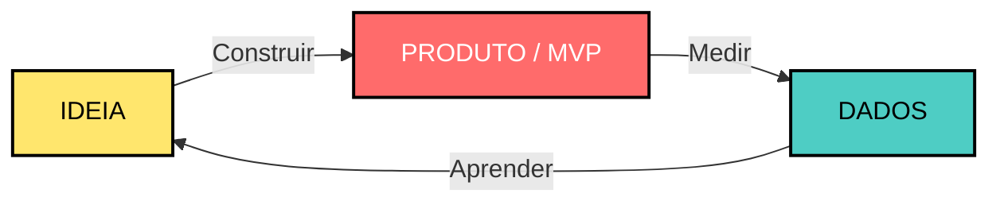
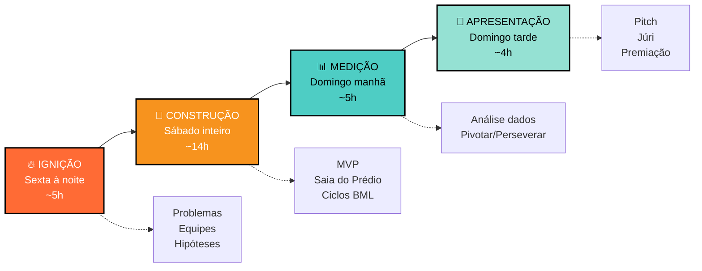
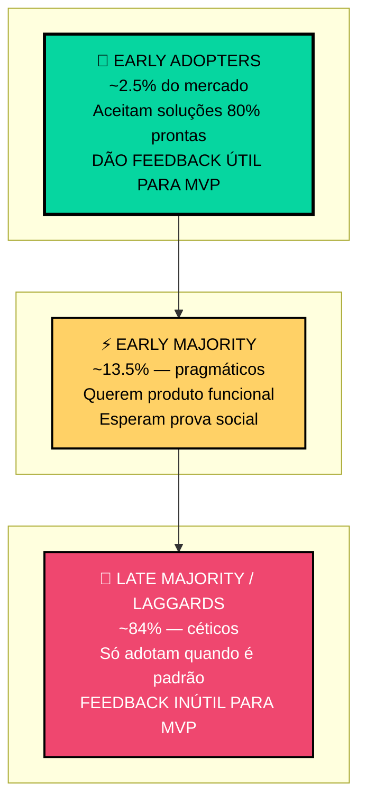
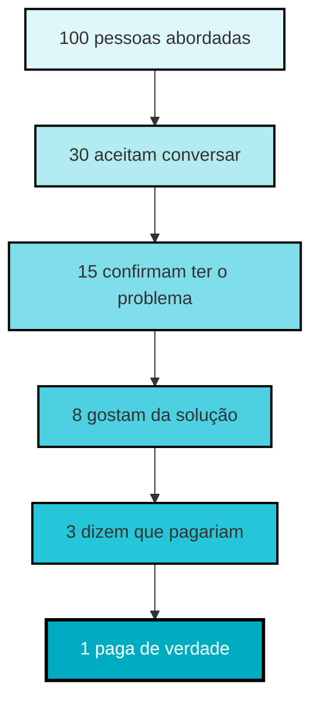
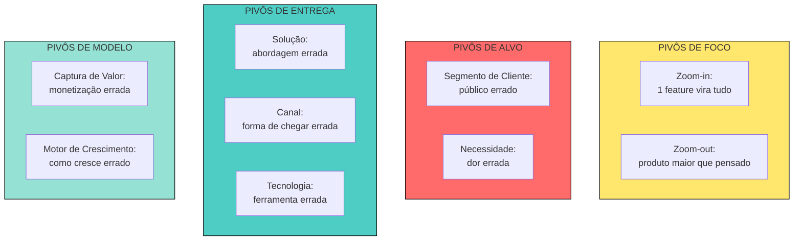
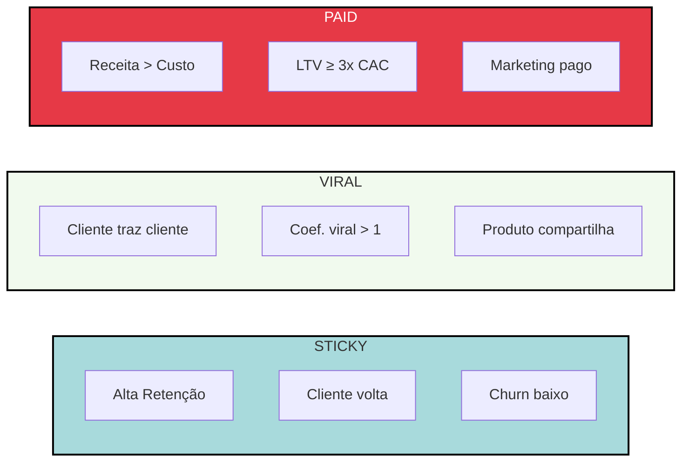
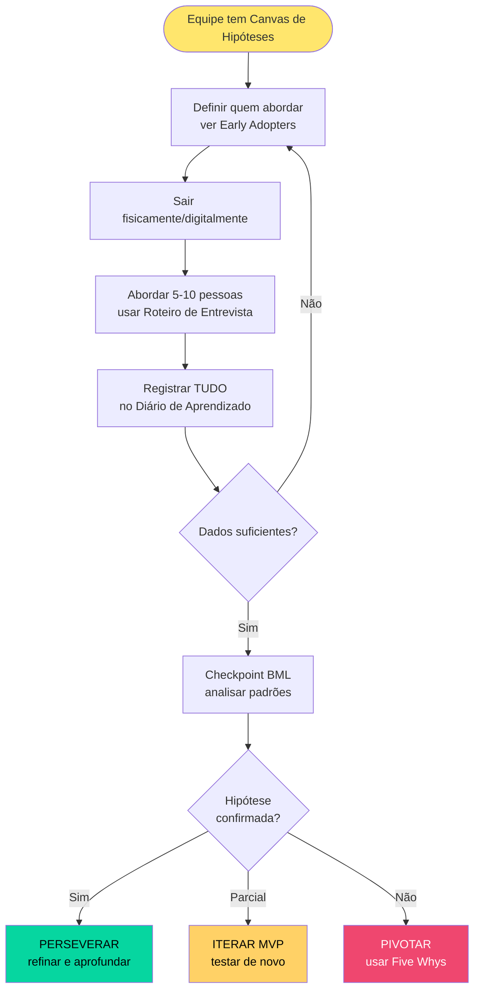

---
tags:
  - startup-rush
  - metodologia
  - diagrama
  - visual
aliases:
  - Diagramas
  - Mapas Visuais
---

# DIAGRAMAS VISUAIS — STARTUP RUSH

> Coleção de diagramas para uso em apresentações, slides, materiais impressos e no Obsidian (os diagramas em **Mermaid** renderizam automaticamente na visualização).
> Cada diagrama vem em 2 formatos: **Mermaid** (para uso no Obsidian/docs) e **Descrição detalhada** (para designer produzir versão visual).

---

## 1. CICLO BUILD-MEASURE-LEARN (BML)

### Versão Mermaid

### Descrição para designer

Círculo com 3 nós conectados em loop contínuo (sentido horário):

1. **IDEIA** (topo) — cor: amarelo vibrante. Ícone: lâmpada. Texto abaixo: "O que acreditamos ser verdade"
2. **CONSTRUIR → PRODUTO/MVP** (direita) — cor: vermelho coral. Ícone: ferramenta/martelo. Texto: "O mínimo para aprender"
3. **MEDIR → DADOS** (base) — cor: turquesa. Ícone: gráfico. Texto: "Reação real de clientes"
4. **APRENDER** (retorno ao topo) — seta grossa curva. Texto: "Validar ou pivotar"

Setas direcionais bem evidentes entre cada etapa. O loop deve sugerir movimento contínuo — pode ter uma indicação tipo "2-3x no evento" no centro.

**Uso:** Slide 5 da [[Apresentação de Abertura]], materiais impressos, Canvas.

---

## 2. AS 4 FASES DO EVENTO

### Versão Mermaid

### Descrição para designer

Linha do tempo horizontal com 4 blocos grandes conectados por setas.

- **Bloco 1 — IGNIÇÃO** (laranja quente, ícone 🔥): "Sexta à noite" + barras mostrando subfases
- **Bloco 2 — CONSTRUÇÃO** (laranja, ícone 🔨): "Sábado inteiro" — bloco maior que os outros (é o mais longo)
- **Bloco 3 — MEDIÇÃO** (turquesa, ícone 📊): "Domingo manhã"
- **Bloco 4 — APRESENTAÇÃO** (verde-água, ícone 🎤): "Domingo tarde"

Abaixo de cada bloco, 3 ícones/pictogramas mostrando as atividades principais. Acima, o tempo total de cada fase.

**Uso:** Slide 7 da Apresentação de Abertura, Guia do Participante, materiais de divulgação.

---

## 3. PIRÂMIDE DE EARLY ADOPTERS

### Versão Mermaid

### Descrição para designer

Pirâmide invertida (triângulo com a ponta para baixo) dividida em 3 faixas horizontais, de cima para baixo:

1. **Topo (mais estreito, verde/turquesa):** "EARLY ADOPTERS — ~2,5%" — adjetivos: "curiosos, tolerantes, engajados". Texto: "São eles que vocês procuram no 'Saia do Prédio'"
2. **Meio (amarelo):** "EARLY MAJORITY — ~13,5%" — adjetivos: "pragmáticos, esperam prova". Texto: "Vão entrar depois"
3. **Base (vermelho, mais largo):** "LATE MAJORITY + LAGGARDS — ~84%" — "céticos, conservadores". Texto: "Não servem para validar MVP"

Ao lado da pirâmide, lista em bullet points:
- ✅ Já tentou resolver o problema por conta própria
- ✅ Usa gambiarras/workarounds
- ✅ Fica animado com solução tosca
- ✅ Deixa contato, quer ser avisado

**Uso:** Briefing do "Saia do Prédio" pelo facilitador, slides de treinamento de facilitadores.

---

## 4. FUNIL DE VALIDAÇÃO (DO PROBLEMA AO PAGAMENTO)

### Versão Mermaid

### Descrição para designer

Funil clássico com 6 níveis descendentes, cada um mais estreito. Cores em gradiente do azul claro ao azul escuro.

**Mensagem-chave (texto ao lado do funil):** "Só o último nível é dado real. Os outros são indicadores parciais. Mire sempre no compromisso mais forte que conseguir em 54h — idealmente, um pagamento (pré-venda)."

**Uso:** Workshop "Métricas que Importam" (Fase 3), guia de interpretação de dados para equipes.

---

## 5. TIPOS DE PIVÔ (MATRIZ)

### Versão Mermaid

### Descrição para designer

Grade 2×2 com 4 categorias, cada categoria contém 2-3 cards:

| | |
|---|---|
| 🎯 **FOCO** (amarelo) Zoom-in / Zoom-out | 👥 **ALVO** (vermelho) Segmento / Necessidade |
| 🚚 **ENTREGA** (turquesa) Solução / Canal / Tecnologia | 💰 **MODELO** (verde) Captura de Valor / Motor |

Cada card com ícone + nome + 1 frase descritiva. Fácil de imprimir em A4 como referência rápida para facilitadores.

**Uso:** Parede da sala durante Fase 3 ("Reunião Pivotar ou Perseverar"), Guia do Facilitador.

---

## 6. OS 3 MOTORES DE CRESCIMENTO

### Versão Mermaid

### Descrição para designer

3 colunas paralelas, cada uma com um motor. Cada coluna tem:

1. **Título grande** com cor distintiva
2. **Ícone central** (Sticky = ímã, Viral = raio, Paid = cifrão)
3. **3 bullet points** com características
4. **Pergunta-chave** na base: "Seu cliente volta?" / "Seu cliente convida?" / "Sua receita paga o marketing?"

**Uso:** Workshop de motores de crescimento (Fase 1 ou Fase 3), [[Canvas de Hipóteses]].

---

## 7. FLUXO "SAIA DO PRÉDIO"

### Versão Mermaid

### Descrição para designer

Fluxograma vertical com decision points (losangos). Estilo limpo, apenas retângulos e setas. Cores semafóricas nas decisões finais: verde (perseverar), amarelo (iterar), vermelho (pivotar).

**Uso:** Briefing do facilitador antes da Fase 2, material de parede da sala.

---

## NOTAS DE USO

1. **No Obsidian:** Os blocos Mermaid renderizam automaticamente no modo Preview. Basta abrir esta nota.
2. **Em slides:** Os diagramas Mermaid podem ser exportados como PNG/SVG de ferramentas online (mermaid.live, diagrams.net).
3. **Para designer:** As descrições textuais abaixo de cada diagrama são o briefing — incluir quando contratar designer para criar versões finais com a identidade visual do evento.
4. **Impressos A3:** Os diagramas 1, 2, 5 e 6 funcionam bem como pôsteres de parede para a sala do evento.

---

*Uma imagem vale mais que mil parágrafos. Esses diagramas devem aparecer em tudo: slides, templates, paredes da sala, Instagram, vídeo introdutório.*
